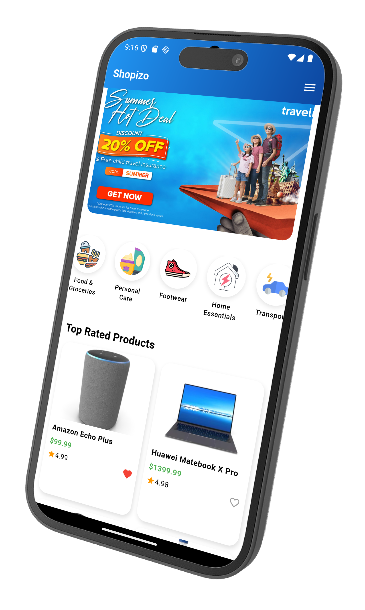
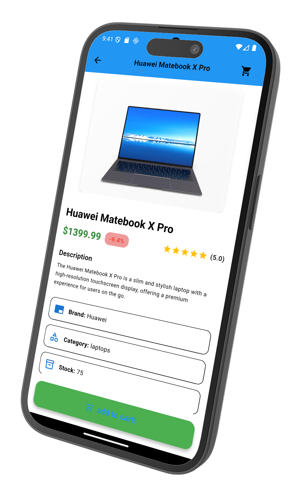
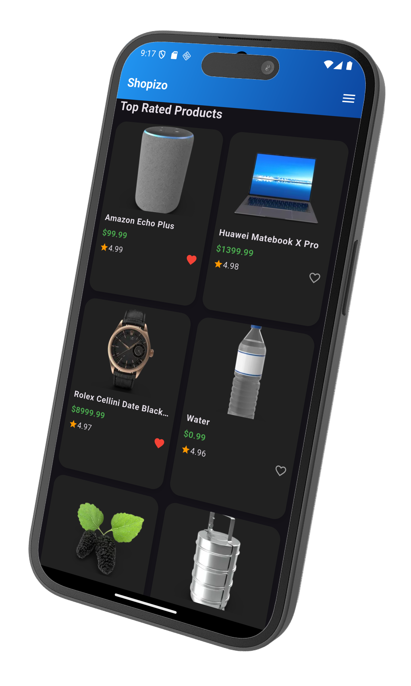
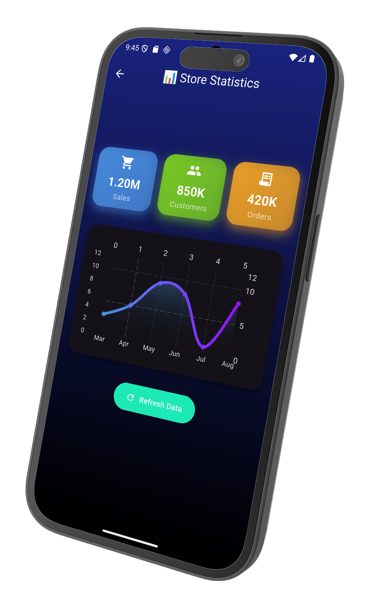
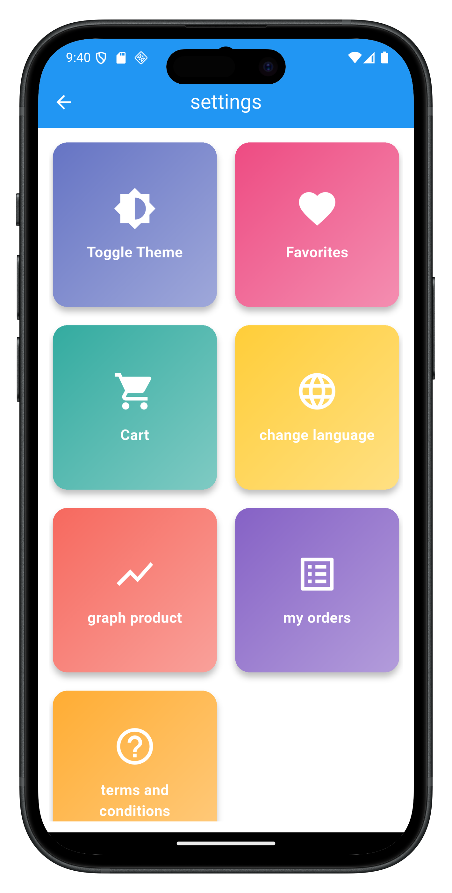
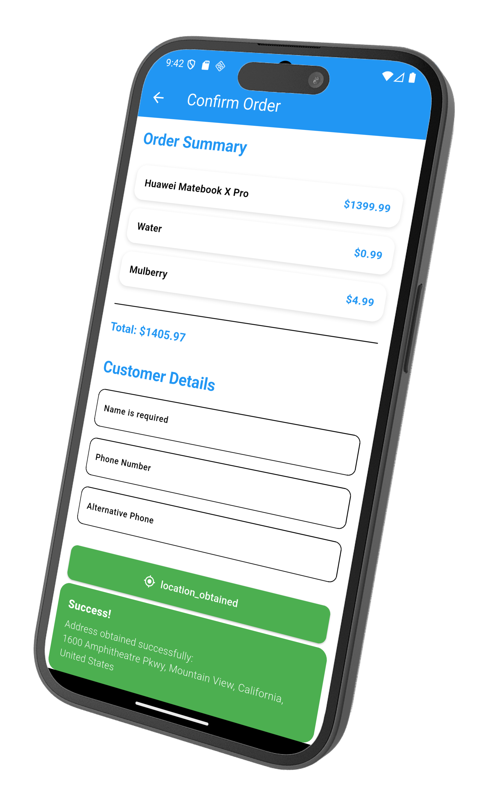
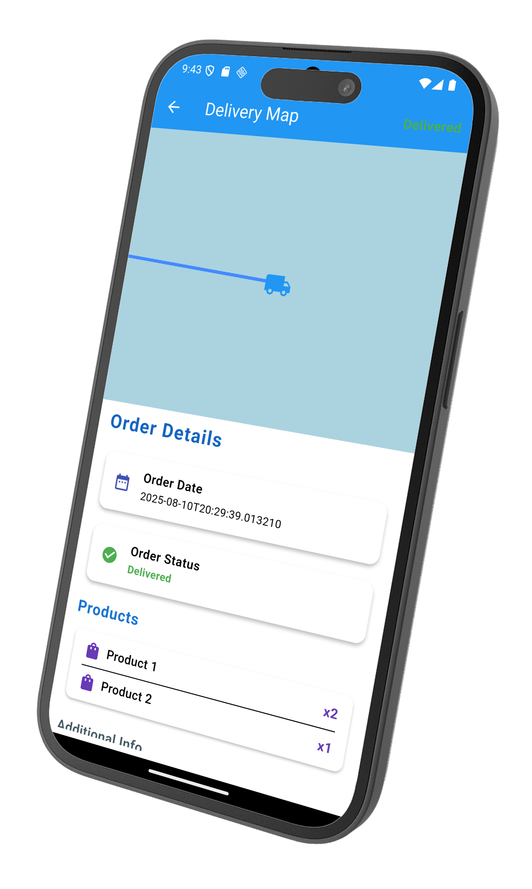
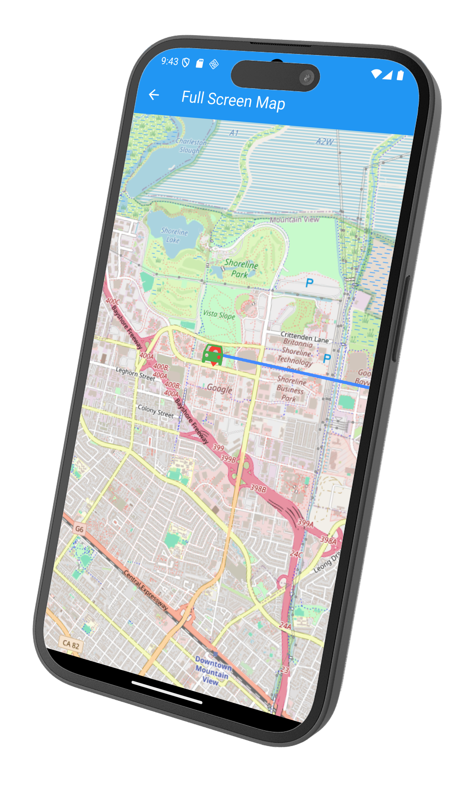

<!-- Banner -->
<p align="center">
</p>

<h1 align="center" style="font-size: 40px; background: linear-gradient(90deg, #ff8a00, #e52e71); -webkit-background-clip: text; color: transparent; font-weight: bold;">
🏆 Shopizo – The Ultimate E-Commerce Experience
</h1>

<p align="center" style="font-size: 18px;">
  <b>Shop smarter. Shop faster. Shopizo.</b><br>
  <span style="color: #888;">⚡ Sleek Design • Smooth UX • Multi-Language Support ⚡</span>
</p>

---

## 🚀 Overview

**Shopizo** is a next-generation **e-commerce mobile app** built with **Flutter** 🐦.  
It’s designed for speed, elegance, and global accessibility – enabling users to **explore products**, **discover offers**, **track orders**, and more, all in one place.

<p align="center">
  
</p>

---

## ✨ Key Features

| 🌟 Feature | 💡 Description |
|-----------|----------|
| 🎯 **Modern UI/UX** | Clean, intuitive, and fully responsive design. |
| 🌍 **Multi-Language** | Breaking language barriers for global users. |
| 🛒 **Smart Cart** | Real-time price updates & quantity control. |
| 📦 **Order Tracking** | Track your shipments directly in the app. |
| ⭐ **Ratings & Best Sellers** | Shop confidently with reviews and top picks. |
| 🔍 **Advanced Search** | Find products in seconds. |

---

## 🖼 Screenshots

<div align="center" style="border: 2px solid #eee; border-radius: 10px; padding: 10px;">
  
|  |  |  |
|---|---|---|
|  |  |  |
|  |  |   |

</div>

---

## 🛠 Tech Stack

<p align="center">
  
  
  
  
  
  
</p>

---

## ⚡ Getting Started

```bash
# 1️⃣ Install Flutter
https://docs.flutter.dev/get-started/install

# 2️⃣ Clone the repository
git clone https://github.com/osama-eslam/shopizo.git

# 3️⃣ Navigate to the project folder
cd shopizo

# 4️⃣ Install dependencies
flutter pub get

# 5️⃣ Run the app
flutter run
