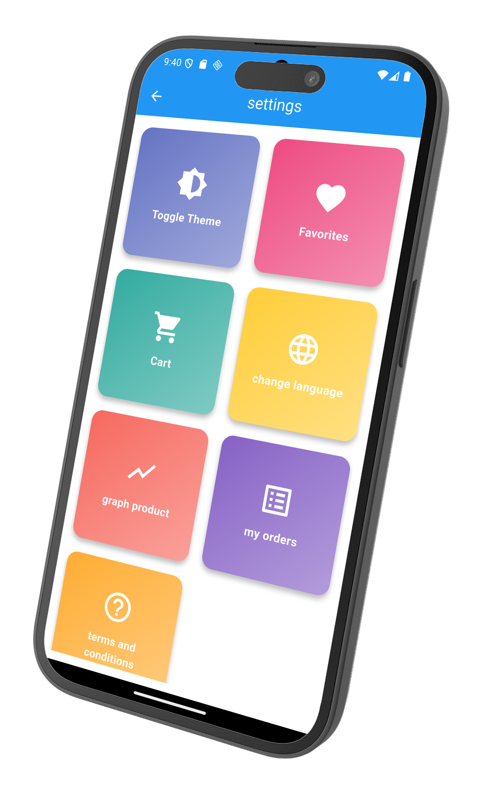

# 🏆 **Shopizo – The Ultimate E-Commerce Experience**

**Shopizo** is a next-generation e-commerce mobile application built with **Flutter**.  
It offers a **sleek design**, **seamless user experience**, and **multi-language support**, enabling users worldwide to shop smarter, faster, and easier.  
With Shopizo, you can explore products, discover offers, manage your orders, and track shipments – all in one app.

---

## ✨ **Why Choose Shopizo?**

- 🎯 **Professional UI/UX** – Modern, clean, and user-friendly interface.
- 🌍 **Multi-Language Support** – Breaking language barriers for global users.
- 🛒 **Smart Shopping Cart** – Real-time price updates and quantity management.
- 📦 **Order Management & Tracking** – Keep an eye on your purchases with ease.
- ⭐ **Product Ratings & Best Sellers** – Make confident buying decisions.
- 🔍 **Advanced Search** – Find exactly what you’re looking for in seconds.
- 📱 **Fully Responsive** – Optimized for both smartphones and tablets.

---

## 📸 **Screenshots**

<div align="center">

|  |  |  |
|---|---|---|
|  |  |  |
|  |  |   |

</div>

---

## 🛠️ **Tech Stack**

- **Flutter** 🐦 – Cross-platform UI toolkit.
- **Dart** 🎯 – Modern, efficient programming language.
- **Provider / BLoC** – Reliable state management solutions.
- **SharedPreferences** – Local storage for a smooth user experience.
- **HTTP** – Easy and fast API integration.

---

## 🚀 **Getting Started**

```bash
# 1️⃣ Install Flutter
https://docs.flutter.dev/get-started/install

# 2️⃣ Clone the repository
git clone https://github.com/osama-eslam/shopizo.git

# 3️⃣ Navigate to the project directory
cd shopizo

# 4️⃣ Install dependencies
flutter pub get

# 5️⃣ Run the app
flutter run
